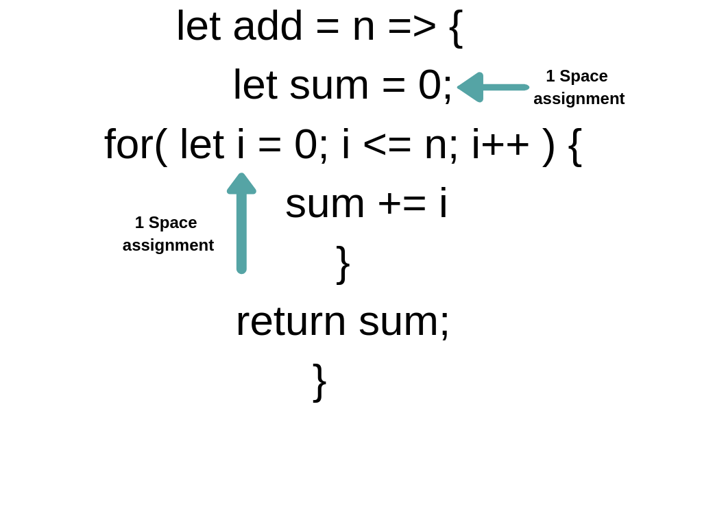
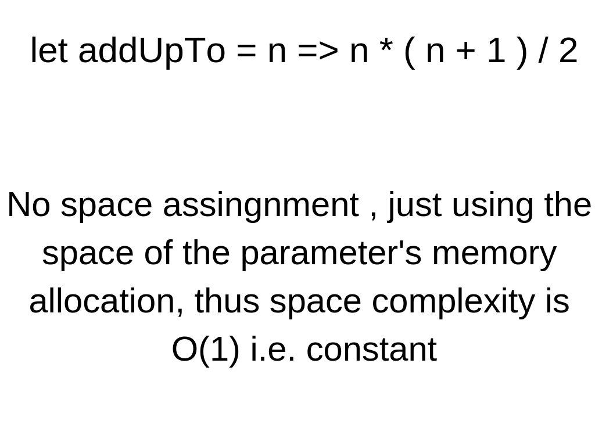

# BIG-O Notation !

#### Big Idea !

Basically the idea , is to somehow measure the quality of code . For example , if we have many methods to solve a 
particular problem, then how will we compare the code , or how will we determine which code is the better , is 
determined by the BIG-O Notation . 

So what does better mean ?? What makes a code better . Well, there are some measures which can be considered to 
measure the code - 

- Fastness 
- Memory-intensiveness
- Readability 

So in the following example, we can see how a code differs in time . The program is to find the sum of all the numbers 
upto the number given . 

```javascript
let add = n => {
	let sum = 0;
	for( let i = 0; i <= n; i++ ) {
		sum += i
	}
	return sum;
}

console.time('Time Elapsed')
add(1000000000)
console.timeEnd('Time Elapsed')
```

and 

```javascript
// Different method

let addUpTo = n => n * ( n + 1 ) / 2

console.time('Time Elapsed addUpTo')
addUpTo(1000000000)
console.timeEnd('Time Elapsed addUpTo')
```

So , here we will find out the following result .


Now , here we can see that , the second method takes way less time than, the first method , because in the first method , the function has to declare a variable ```sum``` then start a for loop and add the i to the ```sum``` variable and finally return sum , whereas in the second method , the function just has to take the provided integer , multiply the integer with its succesor and divide the result by two , which decreases the time .

#### Probelms with time !

- Different machines return different time .
- Same machine return different time ( as seen in the image . )
- For Fast algorithms , speed may not be precise enough, and even if the algorithms are only few miliseconds apart, we cannot truly say that the faster one is better .

#### So, any solution ???

Yes, one of the solutions is that we can consider number of operations an algorithm has to perform in order to check the quality of algorithm, since time can be different on different machines but , the number of calcualtions one machine has to perform has no affect on different machines . So, calculating the operations can be a good measure . And this is what Big-O notation is all about, calculating the number of operations . So, in the above examples given , if we look at the number of operations in the code , we will find ,


Here, we can see that the total number of operations , the algorithm has to perfom is only 3 , thus the Big-O notaion for this algorithm is O(3) or it can be written as __O(1)__ since the number of operations to be performed is constant . So, the time to input graph would be constant .

> Note: Any operation be it +, -, =, /, % etc. takes roughly the same amount of time for any given number . So , for a machine to add 1 + 1 or 1million + 1million is roughly the same, and does not affect the time that much .

But , for the first solution , we can see that there are much much more operations .


Here , the very first operation is assignment . Then in the for loop, we have one more assignment . Then the loop will check after every iteration if the given value of i is less than or equal to n ,  this means we have __n__ operations . Again, since the value of i is incrementing by 1 everytime , this means we have __n__ operations . Then again , the sum is getting incremented , this means we have __n__ operations more . So the Big-O notation for this algorithm is O(3n), which can be written as __O(n)__ . This means the time to input graph for this algorithm is linear .

Now , for different algorithms , we have different trends in operations . We can have Big-O notations of __O(n<sup>2</sup>)__ which are quadratic , or of __O(log(n))__ or __O(nlog(n))__ . 

So, we can see that counting the number of operations each algorithm has to perform can give us better benchmarks in telling the quality of algorithms .

#### Simplifying the Big-O notation !

We can simply the big-o notations we have for different algorithms . We know that different algorithms have different number of operations . Thus , to simplify the notation, there are different thumb rules ( not necessarily ) - 

- Constants do not count .
	- If the notation is O(3n) or O(2n) then simply the trend is linear and thus the notation boils down to O(n). Similarly for O(500) , the notation is O(1) or for O(13n<sup>2</sup>) the notation is simply O(n<sup>2</sup>)

- Smaller terms do not matter .
	- If the notation is O(n+10) then , the notation can be referenced as O(n), or for O(n<sup>2</sup> + 5n + 8) the notation is simply O(n<sup>2</sup>) since , for large n values, 5n + 8 does not even matter in front of n<sup>2</sup>

- Assignment operations and variable assignment are constant i.e. the time taken to add 1 + 1 or 1million + 1million is roughly the same . Similarly , time taken in assigning 1 to a varaible or 1billion to a variable is also roughly the same .
	
- Accessing elements in array ( by elements ) or objects ( by key ) is also constant

- In a loop, the complexity is the length of the loop times the complexity of whatever happens inside of a loop . 

#### Big-O for Space Complexity !

We have talked about the time complexity using the Big-O, but we can also use the Big-O notation for the space complexity of operations. So, for example using our two functions we defined above , we know that , the time complexity for the second function was much better than the first function , but let's now compare the two functions for their space complexity . 



Here , we can see that , we have only two assignments along with the paramter's memory assignment . This means , the space complexity for the algorithm is O(1) that is constant, since the ``` sum += i``` is not making up any other space , just adding to it . Similarly , in the second algorithm , the space complexity is also O(1) since there is no assignment , and only space is made for the input parameter. 



So, we now know that , the space complexity can also be defined using the Big-O notation . 

Now , also let's talk about , how different data structures such as objects and arrays compare to their Big-O notation. 

#### Analyzing Performance of arrays and objects !

Objects are used when the order for the data is not necessary and we need fast access and removal . The insertion, removal and accessing in the objects is pretty fast and of the time complexity __O(1)__ since the order is not required , thus the objects can easily add , store and access the data . Searching however in objects takes time and is of the time complexity __O(n)__ , since when we search for a key value pair , the object has to go through each element , and find out the result . Now this is roughly directly proportional to the inputs in the objects thus , the time complexity is __O(n)__ . Similarly most of the methods of objects have roughly __O(n)__ complexity such as Object.keys(), Object.values(), Object.entries() , since these methods depend on the inputs . For example Object.keys() has to search through the object in order to search for the keys, and thus the time complexity goes to a linear trend with the inputs. However , Object.hasOwnProperty() has the time complexity of __O(1)__ since , it only tells wether the object has that property or not . 

But this is not the case the in arrays . Arrays are used when we need to store data but we also care about the order of the data. Here , the insertion and removal of elements depends on where we are inserting or removing from . For example , if we are inserting or removing elements from the last , i.e. using .push() or .pop() methods , then the time complexity is __O(1)__ constant, since array does not has to do much to add elements to the last of the array . However, if we are adding the elements to the beginning of the array , then the time complexity is __O(n)__ since , the array has to shift all the elements in the array and assing them new indexes . This makes a linear trend with the inputs and thus , the time complexity is __O(n)__ . 

> We need to keep in mind that, accesing the elements in the array is always of the complexity __O(1)__ since , the array does not goes through all the elements to find a particular element , since the index is already stored. So , for an array to access 1st element is same as the array to access its 1millionth element .

> Searching , however , has the time complexity of __O(n)__ since , the array has to go through all the elements in order to find the relevant element .

---